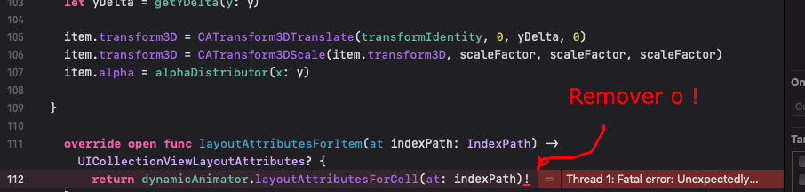

<h1 align="center">Github Search 🔥</h1>
<p>
  
</p>

<p align="center">

</p>

## About

> O Github Search é um app que lista os repositórios mais populares do Swift e seus respectivos PRs

## Getting Started

```sh
git clone https://github.com/gabrielrom/github-search.git 

-- OR WITH GITHUB CLI --

gh repo clone gabrielrom/github-search
```
> Agora precisamos instalar as dependências que o projeto necessita para ser executado, para isso vamos utilizar o CocoaPods.

```sh
cd github-search/github-search 

pod install 

open -a Xcode github-search.xcworkspace
```
## OBS !!!
<p align="left">

</p>

> Caso ao tentar rolar a scroll da lista de repositórios ocorrer um error como esse acima, precisamos remover o "!", isso acontece porque o VegaScroll, que é uma dependencia para fazer a animação da UICollectionView, está com algum bug. Logo após ter feito isso você poderá rodar executar o app novamente!

## Tecnologias utilizadas
- [x] Alamofire (Responsável pela comunicação com API do Github)
- [x] CocoaPods (Responsável pela gestão de dependências no projeto)
- [x] KingFisher (Responsável por baixar imagens da web e fazer seu cache)
- [x] VegaScroll (Responsável por fazer animação da CollectionView)
- [x] RxSwift (Responsável pela gestão dos dados)
- [x] MVVM-C (Arquitetura utilizada)
- [x] Lottie iOS (Responsável por implementar animacoes no ios)

## Requisitos cumpridos
- [x] Versão mínima do iOS : 13.*
- [x] Desenvolvido em Swift 5+ e Xcode 13.1.
- [x] Usar Viewcode
- [x] Gestão de dependências no projeto
- [x] Cache de Imagens
- [x] Mapeamento json -> Objeto
- [x] Framework para Comunicação com API
- [x] Componentes customizados
- [x] Fonte customizadas
- [x] Ao clicar em uma pull request, abrir o browser com a url da PR

## Pontos de melhoras do App
* Criar uma feature para filtrar os PRs pelo o nome do dono da PR
* Implementar testes unitarios & UI Tests
* Criar uma api key para o Github, com isso podemos aumentar o número de requisiçoes permitidas.

## Author

👤 **Gabriel Matheus**

* Website: https://linktr.ee/gabrieIrom
* Github: [@gabrielrom](https://github.com/gabrielrom)
* Link do figma: [@figma](https://www.figma.com/file/X9PcANEaKLkjZMrlMSyiqz/Desafio---Git?node-id=0%3A1)
* Link de inspiração da UI: [@dribble](https://dribbble.com/shots/11526475-Github-Mobile-Concept)


***
_This README was generated with ❤️ by [readme-md-generator](https://github.com/kefranabg/readme-md-generator)